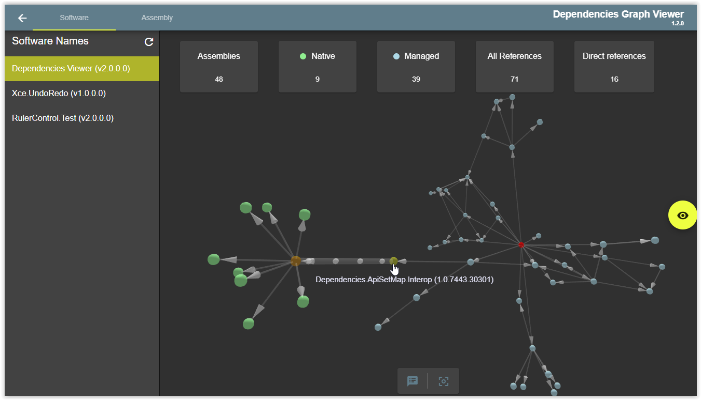

# Dependencies Graph View 

[](/LICENSE)
[![Build][github-actions-badge]][github-actions]
[![Quality Gate Status][sonar-project-badge]][sonar-project]


[![dependencies Status][node-dependencies-badge]][node-dependencies]
[![devDependencies Status][node-dev-dependencies-badge]][node-dev-dependencies]

[](https://open.vscode.dev/organization/repository)

Dependencies Graph View (DGV) provides a view to explore assemblies dependencies store by [Dependencies Graph Services]().

# Features available
- View Software assemblies
- View Assembly dependencies
- Security



## Security

DGV can be connected to Keycloak for authentication. To enable this feature, you need to set environment variables on the docker container.

The security inside DGV is managed by feature, each feature needs one or many rights to be accessible.

Rights are specifics to DGV, you can define the same rights (name) in Keycloak or use rights mapping to link Keycloak rights and software rights.

Software rights:

|        Rights       |       Description        |
| --------------------|------------------------- |
| remove-assembly     | can remove assembly      |


# How to use
## Build sources (Angular CLI)
- `ng serve` for development. Navigate to `http://localhost:4200/`. The app will automatically reload if you change any of the source files.
- `ng build` to build the project.
- more options available on angular CLI web site.


> *This project is configured to work with the [Remote Development][remote-development-plugin-url] plugin.*

## Docker image

A Docker image with this software is available from the [packages][github-package] page.

This image is base on **Linux**. 

You can configure container by setting environment variables.

| Environment variable     |          Comment           |   Example     |
|------------------------- | :--------------------------|--------------------           |
| DEPENDENCIES_GRAPHQL_URI | Graphql services uri       | http://localhost:4001/graphql |
| SECURITY_ENABLED         | Activate  authentication    | true                    |
| SECURITY_SERVER          | Keycloak server            | http://localhost:9080/auth |
| SECURITY_REALM           | Keycloak realm             | dependencies                    |
| SECURITY_CLIENT_ID       | Keycloak client id         | graph                    |
| SECURITY_RIGHT_MAPPING   | Mapping between Keycloak rights and application rights  | {server: 'rs1', app: 'ra1' }, {server: 'rs2', app: 'ra2' }                    |

Port exposed by Container:

|        Name        |       Description        |
| -------------------|------------------------- |
| 80                 | HTTP port for web site   |

You can start a Dependencies Graph Viewer container like this:

```
docker run \
    --publish=80:80 \
    dependencies-graph-viewer:tag
```

# Linked project

|        Project                         |                Build State                              | 
| -------------------------------------- | :-----------------------------------------------------: | 
| [**Graphql services**][graphql-url]       |      [![Build][graphql-badge]][graphql-url]   | 


# Main externals packages
- [Angular](https://angular.io/)
- [Angular Material](https://material.angular.io/)
- [D3](https://d3js.org/)
- [NgRx](https://ngrx.io/)
- [Apollo](https://www.apollographql.com/docs/angular/)
- [Angular keycloak](https://github.com/mauriciovigolo/keycloak-angular)


[github-actions]:                   https://github.com/xclemence/Dependencies-graph-viewer/actions
[github-actions-badge]:             https://github.com/xclemence/dependencies-graph-viewer/workflows/Build/badge.svg?branch=master

[sonar-project]:                    https://sonarcloud.io/dashboard?id=xclemence_dependencies-graph-viewer
[sonar-project-badge]:              https://sonarcloud.io/api/project_badges/measure?project=xclemence_dependencies-graph-viewer&metric=alert_status

[node-dependencies]:                https://david-dm.org/xclemence/dependencies-graph-viewer
[node-dependencies-badge]:          https://david-dm.org/xclemence/dependencies-graph-viewer/status.svg

[node-dev-dependencies]:            https://david-dm.org/xclemence/dependencies-graph-viewer?type=dev
[node-dev-dependencies-badge]:      https://david-dm.org/xclemence/dependencies-graph-viewer/dev-status.svg

[graphql-badge]:                   https://github.com/xclemence/dependencies-graph-graphql/workflows/Node.js%20CI/badge.svg?branch=master
[graphql-url]:                     https://github.com/xclemence/dependencies-graph-graphql

[remote-development-plugin-url]:    https://marketplace.visualstudio.com/items?itemName=ms-vscode-remote.vscode-remote-extensionpack 

[github-package]:                   https://github.com/xclemence/dependencies-graph-services/packages
